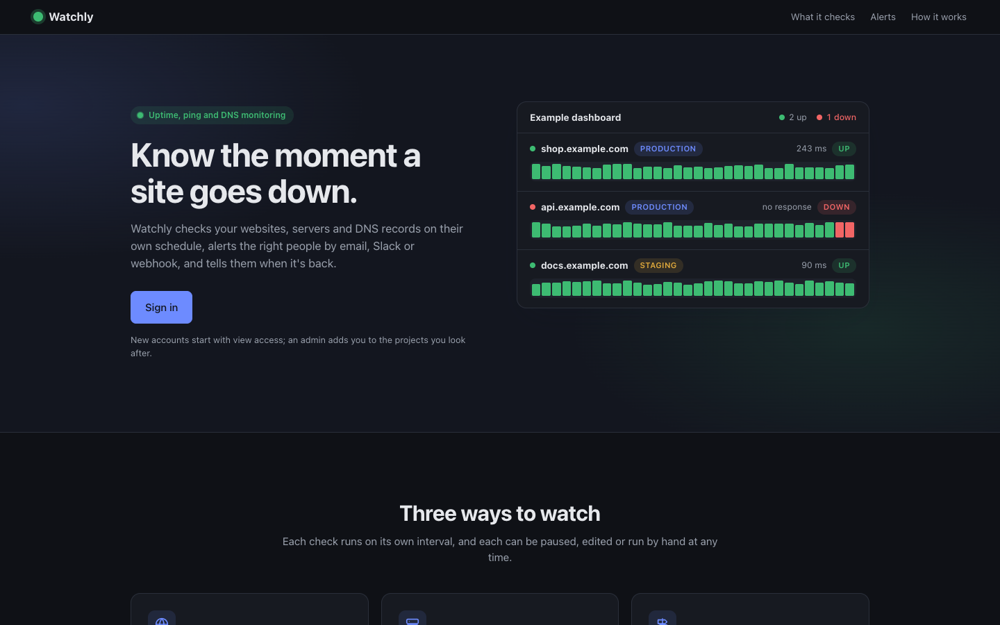
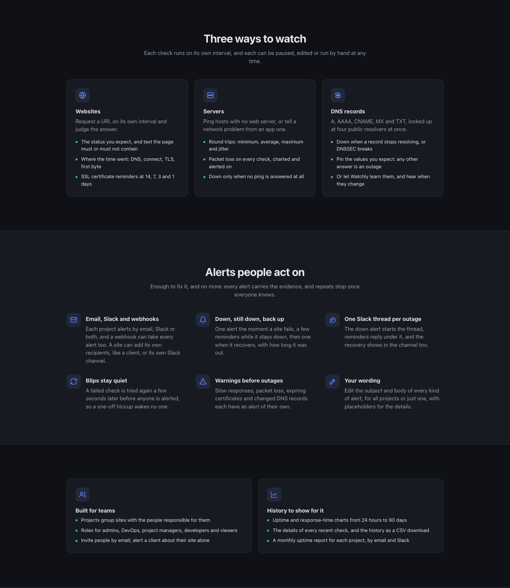
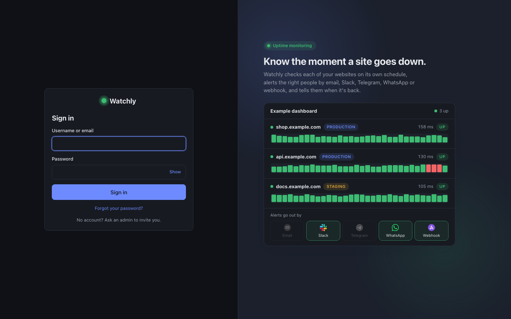

<div align="center">

# Watchly

**Self-hosted uptime monitoring for teams. Know your site is down before your users do.**

[](https://www.python.org/)
[](https://fastapi.tiangolo.com/)
[](https://react.dev/)
[](https://www.postgresql.org/)
[](https://docs.docker.com/compose/)
[](LICENSE)

[Features](#features) · [Quick start](#quick-start) · [Email alerts](#set-up-email-alerts-smtp) · [Configuration](#configuration) · [Docs](#documentation)

<br>



</div>

---

## About

Watchly watches your websites, servers and DNS records around the clock and
tells the right people the moment something breaks. Organize what you monitor
into projects, invite your team with the right roles, and get alerts by email,
Slack, Telegram or webhook, plus a monthly uptime report you can trust.

It runs on your own infrastructure with a single `docker compose up`.

## Features

- **HTTP(S) monitoring**: poll any URL on its own interval, with retries before declaring it down
- **Ping monitoring**: ICMP checks for hosts, including packet-loss alerts
- **DNS monitoring**: query several public resolvers at once and alert when records change or drift from what you expect
- **Early warnings**: SSL certificates about to expire, slow responses and packet loss, not just "down"
- **Alerts where your team works**: email (any SMTP provider), Slack, Telegram and generic webhooks
- **Projects and recipients**: each project's members hear about all of its sites, and each site can add its own recipients
- **Monthly uptime reports**: uptime, downtime and incidents per project, delivered automatically
- **Team management**: invite by email, role-based access (Admin, DevOps, Project Manager, Developer, Viewer), suspension, and invite-only mode
- **Account security**: JWT sessions with refresh tokens, login lockout and password reset by email

## Screenshots

<p align="center">
  
  <br><em>Website, server and DNS checks, with alerts by email, Slack and webhook</em>
</p>

<p align="center">
  
  <br><em>Sign-in page</em>
</p>

## Quick start

**Prerequisite:** [Docker](https://docs.docker.com/get-docker/) with Compose v2.24 or newer.

### 1. Clone the repository

```bash
git clone https://github.com/TahjibNil75/watchly.git
cd watchly
```

### 2. Create your `.env`

```bash
cp .env.example .env
```

Open `.env` and set at least:

- **`SECRET_KEY`**: signs login tokens. Generate one with `openssl rand -hex 32`.
- **`SMTP_*`**: your mail server, so Watchly can send alerts, invitations and
  password resets. See [Set up email alerts (SMTP)](#set-up-email-alerts-smtp).

### 3. Start Watchly

```bash
docker compose up -d --build
```

Database migrations run automatically every time the API starts.

| Service | URL | Description |
| ------- | --- | ----------- |
| Web app | http://localhost:8080 | The Watchly dashboard |
| API     | http://localhost:8000/docs | Interactive API docs |
| Database | `localhost:5432` | PostgreSQL |

### 4. Create the admin account

Open **http://localhost:8080** and sign up.

> [!IMPORTANT]
> **The first user to sign up becomes the Admin.** Watchly doesn't create a
> default admin account. On a fresh install, the first account registered is
> given the `Admin` role, and every account after that joins as a `Viewer`.
>
> Until that first account exists, **anyone who can reach the app can claim
> admin**. Sign up yourself right after the first start, before exposing the
> instance to anyone else.

After signing in as admin you can create projects, add sites to monitor and
invite your team. To stop strangers from signing up, set
`ALLOW_PUBLIC_SIGNUP=false` so people can join only by invitation.

## Set up email alerts (SMTP)

Watchly sends every email through an SMTP server you configure in `.env`: down
and recovery alerts, SSL and slow-response warnings, monthly reports,
invitations and password resets. **If `SMTP_HOST` is empty, no email is sent.**

```dotenv
# --- Alerting ---
ALERTS_ENABLED=true
ALERT_EMAIL_ENABLED=true
# Comma-separated; added to every alert on top of each project's own recipients
ALERT_DEFAULT_EMAILS=devs@example.com
# Public URL of your Watchly dashboard, used for links in emails and invitations
ALERT_DASHBOARD_URL=https://watchly.example.com

# --- SMTP ---
SMTP_HOST=smtp.example.com
SMTP_PORT=587
SMTP_USERNAME=your-smtp-username
SMTP_PASSWORD=your-smtp-password
SMTP_USE_TLS=true
SMTP_USE_SSL=false
SMTP_FROM_EMAIL=alerts@yourdomain.com
SMTP_FROM_NAME=Watchly Alerts
```

Any SMTP provider works. Common settings:

| Provider | `SMTP_HOST` | `SMTP_PORT` | Notes |
| -------- | ----------- | ----------- | ----- |
| AWS SES  | `email-smtp.<region>.amazonaws.com` | `587` | Use SES SMTP credentials |
| Resend   | `smtp.resend.com` | `587` | Username `resend`, password is your API key |
| Mailgun  | `smtp.mailgun.org` | `587` | |
| Gmail    | `smtp.gmail.com` | `587` | Requires an [app password](https://support.google.com/accounts/answer/185833) |

- Use `SMTP_USE_TLS=true` for port **587** (STARTTLS), or `SMTP_USE_SSL=true` for port **465**.
- `SMTP_FROM_EMAIL` must be on a domain verified with your provider, or messages may be rejected.
- Under Docker Compose, `ALERT_DASHBOARD_URL` defaults to `http://localhost:8080`. Set it to your public URL in production.

After editing `.env`, apply the change with `docker compose up -d`. A plain
`restart` doesn't reload `.env`.

<details>
<summary><b>Testing emails locally with Mailpit</b></summary>

[Mailpit](https://mailpit.axllent.org/) catches every email and shows it in a
web inbox, so you can see alerts without a real mail provider.

```bash
docker run -d --name watchly-mailpit -p 8025:8025 -p 1025:1025 axllent/mailpit
```

```dotenv
SMTP_HOST=host.docker.internal
SMTP_PORT=1025
SMTP_USE_TLS=false
```

Run `docker compose up -d`, trigger an alert, then open http://localhost:8025.
If the API runs directly on your machine instead of in Docker, use
`SMTP_HOST=localhost`.

</details>

## Configuration

All settings live in `.env`. [`.env.example`](.env.example) documents every
option. The most important ones:

| Variable | Default | Description |
| -------- | ------- | ----------- |
| `SECRET_KEY` | `dev-secret-change-me` | JWT signing key. **Always change it.** |
| `ALLOW_PUBLIC_SIGNUP` | `true` | Set `false` for an invite-only team (the first user can still sign up) |
| `WEB_PORT` / `API_PORT` | `8080` / `8000` | Ports published by Docker Compose |
| `POSTGRES_USER` / `POSTGRES_PASSWORD` / `POSTGRES_DB` | `postgres` / `postgres` / `watchly` | Database credentials |
| `DEFAULT_CHECK_INTERVAL_SECONDS` | `300` | Default time between checks for a new site |
| `ALERT_DEFAULT_EMAILS` | | Addresses that receive every alert |
| `SLACK_WEBHOOK_URL` / `ALERT_WEBHOOK_URL` | | Optional Slack and webhook channels |
| `TELEGRAM_BOT_TOKEN` / `TELEGRAM_CHAT_ID` | | Optional Telegram fallback for projects without their own bot |
| `SSL_EXPIRY_ALERT_DAYS` | `14,7,3,1` | Days before certificate expiry to warn |
| `DNS_RESOLVERS` | Cloudflare, Google, Quad9, OpenDNS | Resolvers queried by DNS checks |
| `MONTHLY_REPORTS_ENABLED` | `true` | Send the monthly uptime report |

## Useful commands

```bash
docker compose logs -f api          # follow the API and scheduler logs
docker compose up -d --build api    # rebuild after changing backend code
docker compose down                 # stop everything
docker compose down -v              # stop and delete the database
```

## Development

To run the API and UI with hot reload (Python 3.14 and Node.js 20.19+):

```bash
# Database only
docker compose up -d db

# API
python3 -m venv .venv && source .venv/bin/activate
pip install -r requirements.txt
alembic upgrade head
uvicorn app.main:app --reload        # http://127.0.0.1:8000/docs

# Web UI, in a second terminal
cd frontend && npm install && npm run dev   # http://localhost:5173
```

See [`doc/local-setup.md`](doc/local-setup.md) for a full walkthrough and troubleshooting.

## Documentation

| Document | Contents |
| -------- | -------- |
| [`doc/local-setup.md`](doc/local-setup.md) | Running Watchly locally from scratch, step by step |
| [`doc/reference.md`](doc/reference.md) | Technical reference: auth, roles, monitoring, alerting, scheduler, migrations |
| [`doc/hld.md`](doc/hld.md) | High-level design: architecture, data model, key flows |
| [`doc/apis.md`](doc/apis.md) | Every API endpoint with a short description |
| [`frontend/README.md`](frontend/README.md) | The web UI |

## Contributing

Contributions are welcome.

1. Fork the repository and create a branch: `git checkout -b feature/my-feature`
2. Make your changes. If you change the database models, add a migration with `alembic revision --autogenerate -m "..."`
3. Commit and push, then open a pull request describing what changed and why

For bugs and feature requests, please [open an issue](https://github.com/TahjibNil75/watchly/issues).

## License

Watchly is released under the [MIT License](LICENSE).
