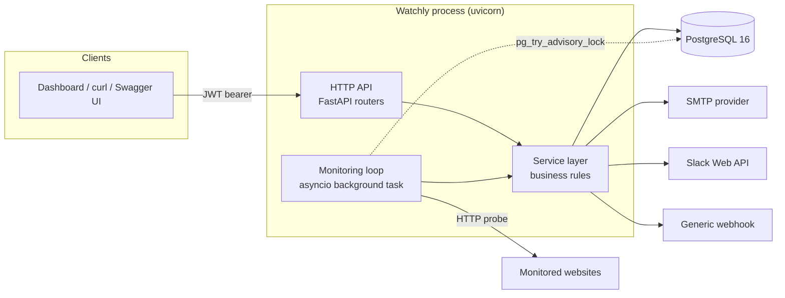
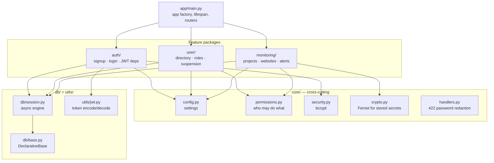
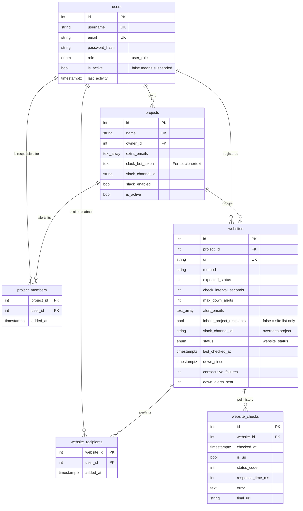
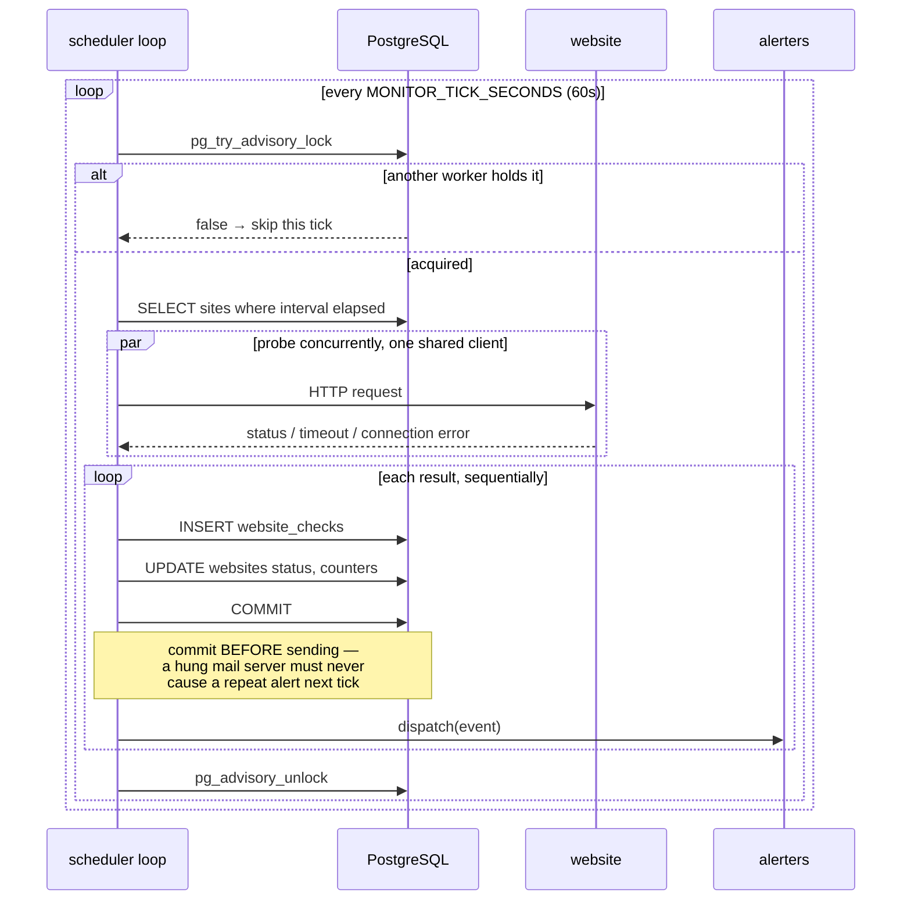
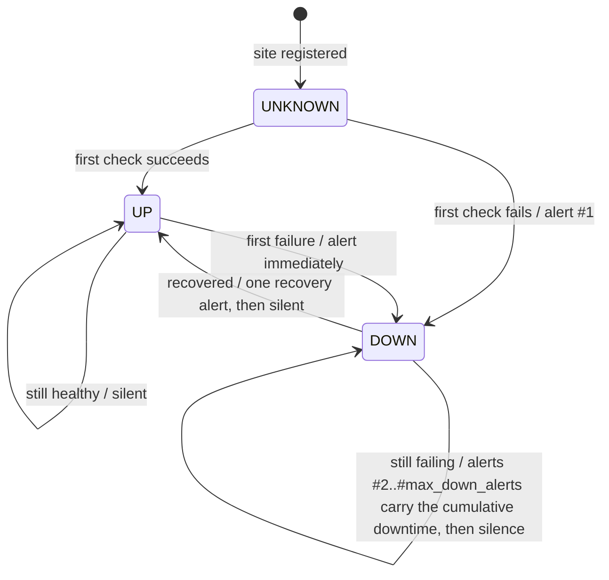
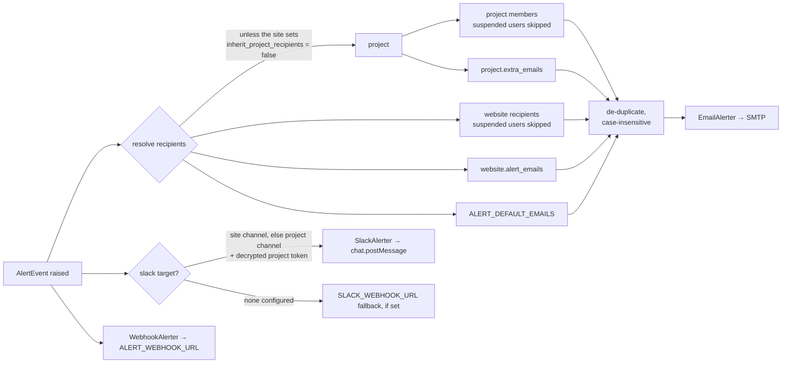

# Watchly — High-Level Design

Watchly polls the websites you register, and tells the people responsible when
one stops answering.

One FastAPI process serves the API **and** runs the polling loop, backed by a
single PostgreSQL database. There is no queue, no worker fleet and no cache —
deliberately, because the workload is small and bounded.

> Companion docs: [`apis.md`](apis.md) for every endpoint, and
> [`app/monitoring/websites/README.md`](../app/monitoring/websites/README.md)
> for the monitoring internals in depth.

---

## 1. System context

```
                    ┌──────────────────────────────────────────┐
   admin / DevOps   │                                          │        ┌───────────────┐
   project manager ─┤            W A T C H L Y                 ├───────▶│ Monitored     │
   developer        │        FastAPI + polling loop            │  HTTP  │ websites      │
   viewer           │                                          │◀───────┤ (the client   │
                    └───────────────┬──────────────┬───────────┘        │  sites)       │
                        JWT / HTTPS │              │                    └───────────────┘
                                    │              │
                          ┌─────────▼────────┐     │  alerts
                          │   PostgreSQL     │     ├──────────────▶ SMTP  (SES, Resend, …)
                          │  users, projects │     ├──────────────▶ Slack (chat.postMessage)
                          │  websites, checks│     └──────────────▶ Webhook (generic JSON)
                          └──────────────────┘
```

| Actor / system | Role |
| -------------- | ---- |
| **People** | Five roles, from `admin` down to `viewer`. See §6. |
| **Watchly** | The single deployable. Serves `/api/v1`, polls sites, sends alerts. |
| **PostgreSQL** | The only persistent store. Also the coordination lock for multi-worker deployments. |
| **Monitored websites** | Third-party targets. Watchly only ever sends them an HTTP request. |
| **SMTP / Slack / Webhook** | Outbound alert channels. Each fails independently. |

---

## 2. Containers



**Why one process.** The loop is a plain `asyncio` task started in the app's
lifespan. Splitting it into a separate worker would add a deployment unit for a
job that is a handful of HTTP requests a minute. The one thing that breaks
under `uvicorn --workers N` — duplicate alerts — is solved by a Postgres
advisory lock rather than by a new component (§5).

Set `MONITORING_ENABLED=false` to run an API-only instance if you ever do want
to separate them.

---

## 3. Components



Every feature package has the same three-layer shape, and the layering is
enforced by what each file is allowed to import:

| Layer | File | Knows about |
| ----- | ---- | ----------- |
| **Routes** | `routes.py` | HTTP. Translates domain errors into status codes. |
| **Service** | `service.py` | Business rules. Raises domain exceptions, never `HTTPException`. |
| **Model / schema** | `models.py`, `schemas.py` | Tables and request/response contracts. |

`utils/jwt.py` and `core/crypto.py` deliberately import no FastAPI, so scripts,
workers and tests can use them.

### Monitoring package

```
app/monitoring/
├── routes.py       aggregates the two sub-routers
├── service.py      MonitoringService — the outage state machine
├── scheduler.py    the background loop + advisory lock
├── projects/       Project, membership, alert-channel config
├── websites/       Website, WebsiteCheck, the HTTP probe
└── alerts/
    ├── base.py     AlertEvent, WebsiteSnapshot, Alerter interface
    ├── email.py    SMTP
    ├── slack.py    per-project bot token + channel
    └── webhook.py  generic JSON POST
```

Adding a channel means one new `Alerter` subclass and one line in
`default_alerters()`; nothing in the state machine changes.

---

## 4. Data model

Six tables, two native Postgres enums, six Alembic migrations.



**Enums** (native Postgres types, storing the declared string values):

- `user_role` — `viewer`, `admin`, `DevOps`, `project manager`, `developer`
- `website_status` — `unknown`, `up`, `down`

**Cascades.** Deleting a project deletes its websites, which deletes their
checks and `website_recipients` rows. Deleting a user nulls `projects.owner_id`
and `websites.created_by_id` but removes their `project_members` and
`website_recipients` rows.

**The live outage state lives on `websites`**, not in memory: `status`,
`down_since`, `consecutive_failures` and `down_alerts_sent`. A restart mid-outage
picks up exactly where it left off, and every worker sees the same state.

---

## 5. Key flows

### 5.1 The monitoring loop



Two invariants worth preserving if you touch this:

1. **State commits before alerts send.** Otherwise a slow SMTP server means the
   next tick re-sends the same alert.
2. **`check_website()` never raises.** DNS failure, TLS error, timeout and a 500
   are all normal outcomes returned as `CheckResult(is_up=False, …)`. If it
   raised, one broken site would abort the whole tick.

### 5.2 Outage state machine



With the defaults — 5-minute interval, `max_down_alerts = 4` — one outage
produces:

```
down → still_down(5m) → still_down(10m) → still_down(15m) → [silence] → recovered(40m)
```

An immediate alert plus three follow-ups, each stating cumulative downtime, then
quiet so a long outage does not flood inboxes. Recovery is announced **once**;
nothing further until the next outage.

### 5.3 Who gets the alert



**Every project must have at least one channel** — email or Slack, or both.
Enforced at create *and* on every later change, so a project cannot be quietly
silenced by clearing its last recipient or removing its last member. **Every
site must too**: a site that stops inheriting its project's recipients needs
recipients of its own (or project Slack), and cannot drop its last one.

Channels fail independently: an alerter that throws is logged and the others
still run.

### 5.4 Authenticated request

```
Bearer token
   → decode + verify signature, expiry, and that it is an access token
   → load the user FROM THE DATABASE
   → reject if the account is suspended            → 403
   → check the role against the endpoint's guard   → 403
   → check per-target rules in the service layer   → 403 / 404
```

**Authorization always reads the role and `is_active` from the database, never
from the token.** The `role` claim is a convenience for the frontend only. This
is what makes a demotion or suspension take effect on the very next request
instead of lingering until the 30-minute access token expires.

---

## 6. Permissions

Five roles. Three distinct questions, three sets, all in
[`app/core/permissions.py`](../app/core/permissions.py):

| Question | Set | Members |
| -------- | --- | ------- |
| Who may change another user's role? | `ROLE_MANAGERS` | admin, DevOps |
| Who may read the whole estate? | `GLOBAL_VIEWERS` | admin, DevOps, project manager |
| Who may create projects? | `PROJECT_CREATORS` | admin, DevOps, project manager |

**Visibility.** Viewers and developers see only the projects they are a member
of and the sites under them, plus any individual site they are a recipient of
(the site and its checks, not its project). Anything else returns **`404`, not
`403`** — a
project you cannot access is indistinguishable from one that does not exist, so
ids cannot be probed. Filtering happens in SQL, not after fetching.

**Suspension** is a table, not a hierarchy — DevOps and project managers can
each suspend the other:

| actor ╲ target | admin | DevOps | project mgr | developer | viewer | self |
| -------------- | ----- | ------ | ----------- | --------- | ------ | ---- |
| admin | ✅ | ✅ | ✅ | ✅ | ✅ | ❌ |
| DevOps | ❌ | ❌ | ✅ | ✅ | ✅ | ❌ |
| project manager | ❌ | ✅ | ❌ | ✅ | ✅ | ❌ |
| developer, viewer | ❌ | ❌ | ❌ | ❌ | ❌ | ❌ |

**Nobody can change or suspend their own account.** That single rule is what
makes lockout impossible: the actor is always an active administrator and never
the target, so no action can leave you with zero administrators.

**Project ownership.** Admin and DevOps manage every project; a project manager
manages only the ones they created, and the sites under them.

---

## 7. Cross-cutting concerns

| Concern | Approach |
| ------- | -------- |
| **Passwords** | bcrypt via the `bcrypt` package directly. `passlib` is unusable on Python 3.13+ — it imports the removed `crypt` module. |
| **Account enumeration** | Login runs bcrypt against a dummy hash when no user matches, so timing does not reveal which accounts exist (measured 1.02 ratio). `is_active` is checked only after the password is proven. |
| **Stored secrets** | Slack bot tokens are Fernet-encrypted at rest and write-only in the API — reads return `slack_configured` and a masked hint. Key from `SLACK_TOKEN_ENCRYPTION_KEY`, falling back to `SECRET_KEY`. |
| **Password leakage** | FastAPI's default 422 body echoes the offending input. A custom handler redacts password fields. |
| **Sessions** | Stateless JWT. Access 30 min, refresh 7 days. No logout endpoint and no revocation — the client discards its tokens. |
| **Async safety** | `Website.project` and `Project.members` use `lazy="selectin"`; a lazy load from the background task would raise `MissingGreenlet`. |
| **Migrations** | Alembic with an async engine. `alembic.ini` leaves `sqlalchemy.url` blank — `env.py` reads it from settings. |

---

## 8. Deployment

```
uvicorn app.main:app --workers N
        │
        ├── worker 1 ── API + loop (holds the tick lock)
        ├── worker 2 ── API + loop (skips ticks)
        └── worker N ── API + loop (skips ticks)
                 │
                 └── PostgreSQL 16
```

Every worker runs the loop, but only the lock holder does the work, so alerts
are never duplicated. Requirements: PostgreSQL 16, **Python 3.11+** (the code
uses `datetime.UTC`; developed and tested on 3.14), and outbound HTTPS to the
monitored sites and alert providers.

`docker-compose.yml` brings up Postgres for local work. Startup order:
`alembic upgrade head` → `python -m app.db.seed` → run the app.

**Configuration is entirely environment variables** (`app/core/config.py`, via
pydantic-settings). The app logs a warning at startup if `SECRET_KEY` is still
the default, or if monitoring is on with no `SMTP_HOST`.

---

## 9. Known limits

Worth knowing before this carries real load:

| Limit | Detail |
| ----- | ------ |
| **`website_checks` grows unbounded** | One row per site per interval — roughly 105k rows per site per year at 5 minutes. `WebsiteService.purge_old_checks()` exists but **nothing calls it**. Wire it to a cron before production. |
| **Single-node loop** | One worker does all the probing. Fine for hundreds of sites; thousands would want sharding or a real scheduler. |
| **No alert retry** | A failed delivery is logged, not queued. The next follow-up alert is the recovery mechanism. |
| **No audit trail** | Nothing records who changed a role, suspended an account or edited a project. The main gap in the permissions story. |
| **No refresh endpoint** | Refresh tokens are issued and validated, but there is nowhere to redeem one, so sessions end after 30 minutes. |
| **Key rotation** | Changing `SECRET_KEY` invalidates every session *and* makes stored Slack tokens unreadable. `decrypt_secret` degrades quietly; the tokens must be re-entered. |

---

## 10. Where things are

| I want to… | Look at |
| ---------- | ------- |
| See every endpoint | [`doc/apis.md`](apis.md) |
| Understand monitoring in depth | [`app/monitoring/websites/README.md`](../app/monitoring/websites/README.md) |
| Change who can do what | [`app/core/permissions.py`](../app/core/permissions.py) |
| Change when alerts fire | `record_result()` in [`app/monitoring/service.py`](../app/monitoring/service.py) |
| Change how a site is probed | [`app/monitoring/websites/checker.py`](../app/monitoring/websites/checker.py) |
| Add an alert channel | [`app/monitoring/alerts/`](../app/monitoring/alerts/) + `default_alerters()` |
| Change the polling cadence | `MONITOR_TICK_SECONDS`, or per-site `check_interval_seconds` |
| Add a table | The model module, then `alembic revision --autogenerate` |
